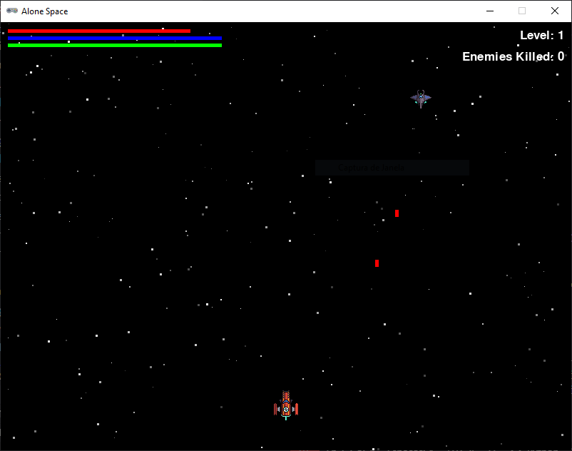

# Alone Space

## Como Jogar
**Alone Space** é um jogo de navegação espacial onde você controla uma nave e deve sobreviver enquanto evita obstáculos e atira contra inimigos. Siga as instruções abaixo para aprender como jogar:

## Controles

- **Menu Principal:**
  - Use as teclas **W** para selecionar a opção acima.
  - Use as teclas **S** para selecionar a opção abaixo.
  - Pressione **Espaço** para confirmar a seleção.
  
- **Mudar o volume:**
  - No menu, selecione a opção "Áudio" para ativar ou desativar o som do jogo.

- **Pausar o Jogo:**
  - Pressione **Esc** durante o jogo para retornar ao menu principal.

- **Movimentação da Nave:**
  - Use as teclas **A** para mover a nave para a esquerda.
  - Use as teclas **D** para mover a nave para a direita.
  - Use as teclas **W** para acelerar.
  - Use as teclas **S** para reduzir a velocidade (frear).

- **Atirar:**
  - Pressione a tecla **E** para disparar tiros leves (menor custo de energia, menor dano).
  - Pressione a tecla **Q** para disparar um ataque pesado (maior custo de energia, maior dano).

- **Escudo:**
  - Pressione a tecla **F** para ativar ou desativar o escudo (consome energia do escudo).

## Objetivo

O objetivo do jogo é eliminar o maior número possível de inimigos enquanto gerencia sua energia, saúde e escudo.

- **Energia:** Usada para acelerar, atirar. Regenera automaticamente com o tempo.
- **Saúde:** Mostra sua vida no jogo. Regenera lentamente.
- **Escudo:** Protege a nave de danos. Consome energia quando ativado. Regenera lentamente.

## Boa sorte e divirta-se!
